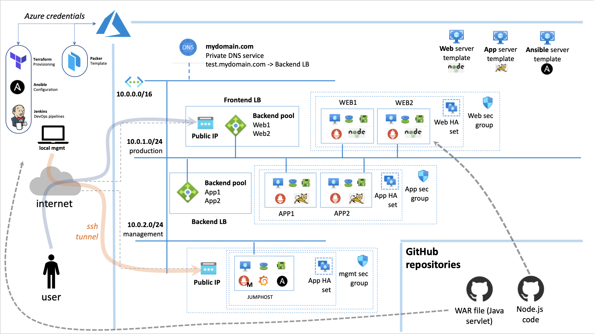

# INTRODUCTION

Deploy a three-tier-app (currently just web and app layer) using packer templates, terraform provisioning techniques and ansible playbooks.



# PACKER

Use this tool to create template images in your Azure account for the servers you are going to deploy.

## Configure
- Enable AZURE credentials before launch packer commands
```
  export ARM_SUBSCRIPTION_ID=XXXXXXX
  export ARM_CLIENT_ID=XXXXXXX
  export ARM_CLIENT_SECRET=XXXXXXX
  export ARM_TENANT_ID=XXXXXXX
```

## Run
- run "packer build template_name.json" from ./packer_templates

# TERRAFORM

Use this tool to deploy all the infrastructure resources your application need (network, servers, storage ...)

## Configure
- Enable AZURE credentials before launch terraform commands
```
  export ARM_SUBSCRIPTION_ID=XXXXXXX
  export ARM_CLIENT_ID=XXXXXXX
  export ARM_CLIENT_SECRET=XXXXXXX
  export ARM_TENANT_ID=XXXXXXX
```
- Configure tags (jumphost=tag_environment_management, web=tag_environment_web, app=tag_environment_app). Please take care about tag choice. Right now the code is not fully automated. See the onboard-servers.sh file to see what is missing to fully automate it.

## Run
- run "terraform apply" from ./terraform_main folder to deploy the resources listed in main.tf
- run "terraform destroy" to shut down everything you just created

# ANSIBLE

Use this tool to configure all the infrastructure resources deployed with terraform.
Install all the useful packages, download the gitrepos and start the app services.

## Configure
- name of the AZURE resource group on which run dynamic inventory (myazure_rm.yml)
- name of the user (we are assuming that all the hosts have one user defined with that name)
- name of the gitrepos (in this example web is based on node.js app and app is based on .war file)
- Configure tags (jumphost=tag_environment_management, web=tag_environment_web, app=tag_environment_app)

### NOTE: the last point is highly dependent on terraform provisioning and it is not yet completely dynamic.

## Security
- Create a password file (don't upload this file on a gitrepo)
  echo "mypassword" > password_file
- Change the credential file with your azure credential file and encrypt it

  `ansible-vault encrypt --vault-id [path_to_the_file_with_your_password] credentials`
- Update the password used by the ansible user to logon on private servers (we are using a symetric approach for private comunication)

  `ansible-vault encrypt_string --vault-id [path_to_the_file_with_your_password] [your_server_password]`
- Insert the vault string just created in the deploy-master.yml file in the variable "server_password"

### NOTE: Azure credential file has the following structure:

```
[default]
subscription_id=XXXXXXX
client_id=XXXXXXX
secret=XXXXXXX
tenant=XXXXXXX
```

## Run

- To deploy all the configurations run

`ansible-playbook --vault-id [path_to_the_file_with_your_password] -i ./myazure_rm.yml deploy-master.yml -l [jumphost_azure_tag]`

# JENKINS

Use this tool to orchestrate pipelines.
Current Jenkinsfile covers only local jenkins server orchestration.

## Configure

- Install and run on your local machine Jenkins.
- Create your own pipeline project and configure the pipeline section with "Pipeline script from SCM". Use the URL of this git repository.The script path must be Jenkinsfile.
- Download the repository
- Add azure credentials in jenkins as secret text (see https://www.jenkins.io/doc/book/using/using-credentials/)
- Set the environment variables with the path of the terraform and ansible scripts (TF_WORKSPACE and AB_WORKSPACE)
- Set the path to the password file for ansible playbooks (AB_SECRET_FILE)

## Run

Click on "build now" in the overview page of your jenkins project.
