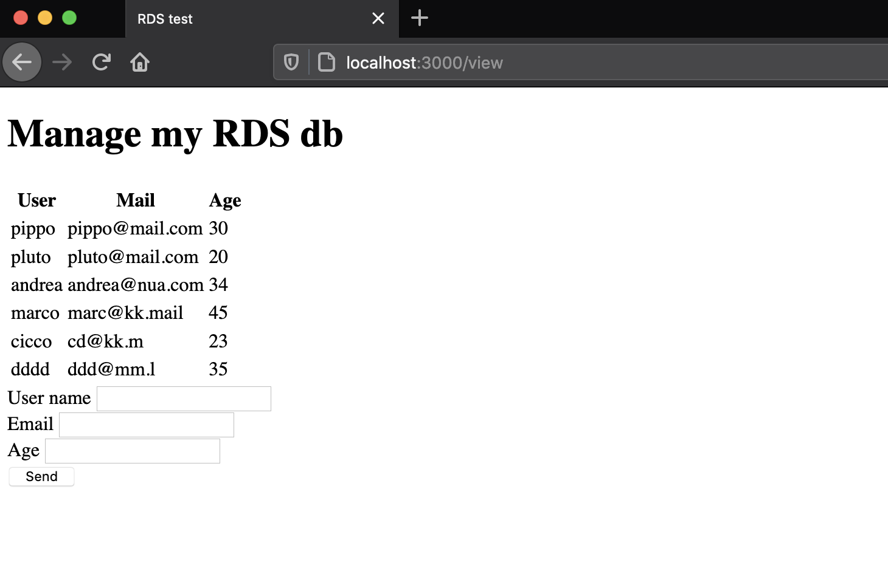

# RDS enpoint - WIP (NOT WORKING)

Deploy a EC2 with a node.js app and a mySQL RDS instance. Store the db secret in AWS SecretsManager.


| Resource | Estimated cost (without VAT) | Link |
|------|---------|---------|
| EC2 | 0,13 $/h x # of instances | [Pricing](https://aws.amazon.com/ec2/pricing/on-demand/) |
| RDS | 0,2 $/h x # of instances (it can increase if you upload a lot of data, see RDS Storage usage type)| [Pricing](https://aws.amazon.com/rds/mysql/pricing/?pg=pr&loc=2) |
| SecretsManager | <0,4$/month per secret - see pricing | [Pricing](https://aws.amazon.com/secrets-manager/pricing/) |
| Route53 | if deleted within 12h no charges are applied | [Pricing](https://aws.amazon.com/route53/pricing/) |

| Automation | Time |
|------|---------|
| terraform apply (1st run) | 1 min |
| terraform apply (2nd run) | 7 min |
| ansible-playbook | 30 sec |
| terraform destroy | 5 min |

## Useful links

[AWS VPC Endpoints](https://docs.aws.amazon.com/vpc/latest/userguide/vpce-interface.html)

## Usage

### Set db Credentials

Set user, password, AWS SecretsManager name and db DNS name in `set_db_credentials.sh` script and than run it
```
. ./set_db_credentials.sh
```
**Important:** If you already used the same AWS SecretsManager name remember that each AWS secret needs at least 7 days to complete the deletion of the secret. Until the end of this period you cannot use the same secret name.

Set also `config.service` with the same DNS name and with the region name that you are going to use.

Generete your [public ssh key](https://www.ssh.com/ssh/keygen/) and update `main.tf` file with your `id_rsa.pub` in the field `public_key` of the `aws_key_pair` resource.

Now you can deploy the terraform infrastructure.

### Deploy EC2, RDS and AWS SecretsManager

To run this example you need to execute:

```
$ terraform init
$ terraform plan
$ terraform apply
```
Run terraform apply one more time if something goes wrong.

Note that this example may create resources which can cost money (AWS Elastic IP, for example). Run `terraform destroy` when you don't need these resources.

### Check which EC2/RDS couple are you using


### Deploy node.js app

Before this step you have to deploy the terraform script.

If you already updated the `config.service` just run the following command from the `playbooks` folder (please check if ec2.py is already executable or note, if note run `chmod +x ec2.py`).
```
ansible-playbook -i ./ec2.py ./configure_nodejs.yml -l tag_Name_fe_server
```

On your preferred browser, go to `<EC2-instance-public-ip>:8080/views`, you should see a screen like this (with zero rows because the db is still empty)



<!-- BEGINNING OF PRE-COMMIT-TERRAFORM DOCS HOOK -->
## Requirements

| Name | Version |
|------|---------|
| terraform | >= 0.12.21 |
| aws | >= 2.68 |
| ansible | >= 2.9.1 |

## Providers

| Name | Version |
|------|---------|
| aws | >= 2.68 |

## Inputs

| Name | Description |
|------|---------|
| awsusername | Aws username to tag resources with owner |
| db_username | username for the MySQL db |
| db_password | password for the MySQL db |
| db_private_dns | domain called by the node.js app to call the mysql db |
| db_secret_name | name of the secret to store in AWS SecretsManager |

## Outputs

No outputs


<!-- END OF PRE-COMMIT-TERRAFORM DOCS HOOK -->
