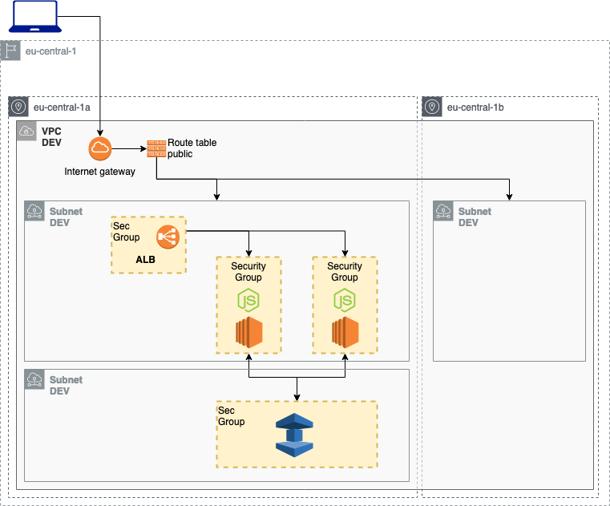

# Deploy Network Load Balancer

Deploy two EC2 with a node.js app and test Elasticache AWS service (memcache).

| Resource | Estimated cost (without VAT) | Link |
|------|---------|---------|
| ALB | 0.027 $/h + 0.006 $/h per NLCU-hour | [Pricing](https://aws.amazon.com/elasticloadbalancing/pricing/?nc=sn&loc=3) |
| EC2 | 0,013 $/h x # of instances | [Pricing](https://aws.amazon.com/ec2/pricing/on-demand/) |
| MEMCACHE | 0,019 $/h x # of memcache nodes| [Pricing](https://aws.amazon.com/elasticache/pricing/) |

| Automation | Time |
|------|---------|
| terraform apply | 5min 30sec |
| ansible-playbook | 1 min |
| terraform destroy | 5 min |

<!-- BEGINNING OF PRE-COMMIT-TERRAFORM DOCS HOOK -->
## Requirements

| Name | Version |
|------|---------|
| terraform | >= 0.12.21 |
| aws | >= 2.68 |
| ansible | >= 2.9.1 |

## Providers

| Name | Version |
|------|---------|
| aws | >= 2.68 |

## Inputs

| Name | Description |
|------|---------|
| awsusername | Aws username to tag resources with owner |
| db_username | username for the MySQL db |
| db_password | password for the MySQL db |
| db_private_dns | domain called by the node.js app to call the mysql db |
| db_secret_name | name of the secret to store in AWS SecretsManager |

## Outputs

| Name | Description |
|------|---------|
| ec2_public_ips | vector of public ip of EC2 instances |
| ec2_private_ips | vector of public ip of EC2 instances |
| elastic_public_ip | The public ip of the loadbalancer |

<!-- END OF PRE-COMMIT-TERRAFORM DOCS HOOK -->
