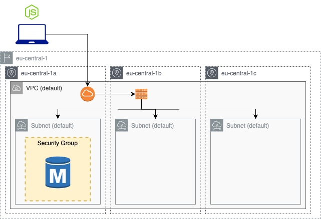

# RDS usage - WIP

Deploy a mySQL RDS instance and use mySQL dbs stored in it through a local node.js application.



| Resource | Estimated cost (without VAT) | Link |
|------|---------|---------|
| RDS | 0,2 $/h (it can increase if you upload a lot of data, see RDS Storage usage type)| [Pricing](https://aws.amazon.com/rds/mysql/pricing/?pg=pr&loc=2) |

| Topic | Data |
|------|---------|
| Time to deploy | 6 min |
| Time to destroy | 4 min |

## Useful links

[AWS RDS site](https://docs.aws.amazon.com/rds/index.html?nc2=h_ql_doc_rds)

## Usage

### Set db Credentials

Set user and password in `set_db_credentials.sh` script and than run it
```
. ./set_db_credentials.sh
```

Now you can deploy the db instance with terraform. Remember that at the and of the terraform deployment phase you have to copy/paste the `this_db_instance_endpoint` output variable (without the port number) in `dbsees.js` and `index.js`.

### Deploy RDS instance

To run this example you need to execute:

```
$ terraform init
$ terraform plan
$ terraform apply
```

Note that this example may create resources which can cost money (AWS Elastic IP, for example). Run `terraform destroy` when you don't need these resources.

### Set-up node.js app

Before to do this step you have to deploy an RDS mySQL instance.

If you do not have npm yet installed please follow this [guide](https://docs.npmjs.com/downloading-and-installing-node-js-and-npm).

Update `dbseed.js` and `index.js` with your RDS inputs (if you user the `set_db_credentials.sh` script you just need to update `<your-db-endpoint>`):
```
const con = mysql.createConnection({
    host: "<your-db-endpoint>",                  //Find this info in terraform output or in the db panel Connectivity&Security (don't add port)
    user: "<admin-name>",                        //The user name you defined during provisioning
    password: "<your-rds-instance-password>"     //The password you defined during provisioning
});
```
Run `dbseed.js` to create the table
```
node dbseed.js
```
You should get a message like this
```
OkPacket {
  fieldCount: 0,
  affectedRows: 0,
  insertId: 0,
  serverStatus: 2,
  warningCount: 1,
  message: '',
  protocol41: true,
  changedRows: 0 }
```
Now that you have created the main table you can run your code
```
node index.js
```
On your preferred browser, go to `localhost:3000/views`, you should see a screen like this (with zero rows because it is still empty)


## Requirements

| Name | Version |
|------|---------|
| terraform | >= 0.12.21 |
| aws | >= 2.68 |
| node | >= 10.13.0 |
| npm | >= 6.4.1 |

## Providers

| Name | Version |
|------|---------|
| aws | >= 2.68 |

## Inputs

| Name | Description |
|------|---------|
| awsusername | Aws username |
| db_username | db username |
| db_password | db password |

## Outputs

| Name | Description |
|------|-------------|
| this\_db\_instance\_endpoint | The connection endpoint |
