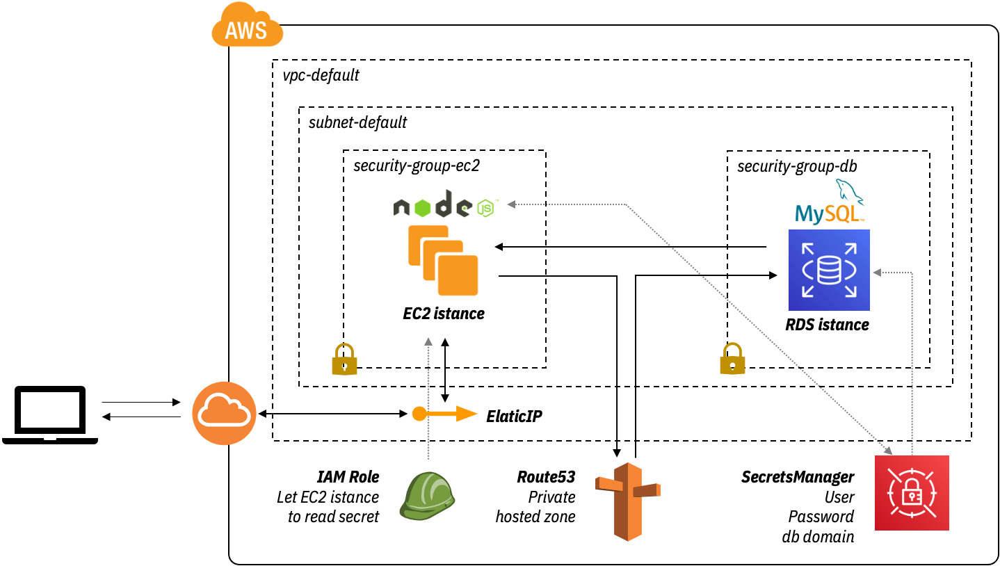

# RDS usage - WIP

Deploy a EC2 with a node.js app and a mySQL RDS instance. Store the db secret in AWS SecretsManager.




| Resource | Estimated cost (without VAT) | Link |
|------|---------|---------|
| EC2 | 0,13 $/h | [Pricing](https://aws.amazon.com/ec2/pricing/on-demand/) |
| RDS | 0,2 $/h (it can increase if you upload a lot of data, see RDS Storage usage type)| [Pricing](https://aws.amazon.com/rds/mysql/pricing/?pg=pr&loc=2) |
| SecretsManager | see Pricing | [Pricing](https://aws.amazon.com/secrets-manager/pricing/) |
| Route53 | if deleted within 12h no charges are applied | [Pricing](https://aws.amazon.com/route53/pricing/) |
| Elastic IP | 0 $/h (it costs only if it is not assigned to EC2 0,05$/h)| [Pricing](https://aws.amazon.com/premiumsupport/knowledge-center/elastic-ip-charges/) |

| Automation | Time |
|------|---------|
| terraform apply | 8 min |
| ansible-playbook | 30 sec |
| terraform destroy | 5 min |

## Useful links

[AWS RDS site](https://docs.aws.amazon.com/rds/index.html?nc2=h_ql_doc_rds)

## Usage

### Set db Credentials

Set user, password, AWS SecretsManager name and db DNS name in `set_db_credentials.sh` script and than run it
```
. ./set_db_credentials.sh
```
**Important:** If you already used the same AWS SecretsManager name remember that each AWS secret needs at least 7 days to complete the deletion of the secret. Until the end of this period you cannot use the same secret name.

Set also `config.service` with the same DNS name and with the regione name that you are going to use.

Now you can deploy the terraform infrastructure.

### Deploy EC2, RDS and AWS SecretsManager

To run this example you need to execute:

```
$ terraform init
$ terraform plan
$ terraform apply
```
Run terraform apply one more time if something goes wrong.

Note that this example may create resources which can cost money (AWS Elastic IP, for example). Run `terraform destroy` when you don't need these resources.

### Deploy node.js app

Before this step you have to deploy the terraform script.

If you already updated the `config.service` just run the following command from the `playbooks` folder.
```
ansible-playbook -i ./ec2.py ./configure_nodejs.yml -l tag_Name_fe_server
```

On your preferred browser, go to `<EC2-instance-public-ip>:8080/views`, you should see a screen like this (with zero rows because the db is still empty)


<!-- BEGINNING OF PRE-COMMIT-TERRAFORM DOCS HOOK -->
## Requirements

| Name | Version |
|------|---------|
| terraform | >= 0.12.21 |
| aws | >= 2.68 |
| ansible | >= 2.9.1 |

## Providers

| Name | Version |
|------|---------|
| aws | >= 2.68 |

## Inputs

| Name | Description |
|------|---------|
| awsusername | Aws username |
| db_username | db username |
| db_password | db password |

## Outputs

| Name | Description |
|------|-------------|
| this\_db\_instance\_address | The address of the RDS instance |
| this\_db\_instance\_arn | The ARN of the RDS instance |
| this\_db\_instance\_availability\_zone | The availability zone of the RDS instance |
| this\_db\_instance\_endpoint | The connection endpoint |
| this\_db\_instance\_hosted\_zone\_id | The canonical hosted zone ID of the DB instance (to be used in a Route 53 Alias record) |
| this\_db\_instance\_id | The RDS instance ID |
| this\_db\_instance\_name | The database name |
| this\_db\_instance\_password | The database password (this password may be old, because Terraform doesn't track it after initial creation) |
| this\_db\_instance\_port | The database port |
| this\_db\_instance\_resource\_id | The RDS Resource ID of this instance |
| this\_db\_instance\_status | The RDS instance status |
| this\_db\_instance\_username | The master username for the database |
| this\_db\_parameter\_group\_arn | The ARN of the db parameter group |
| this\_db\_parameter\_group\_id | The db parameter group id |
| this\_db\_subnet\_group\_arn | The ARN of the db subnet group |
| this\_db\_subnet\_group\_id | The db subnet group name |


<!-- END OF PRE-COMMIT-TERRAFORM DOCS HOOK -->
